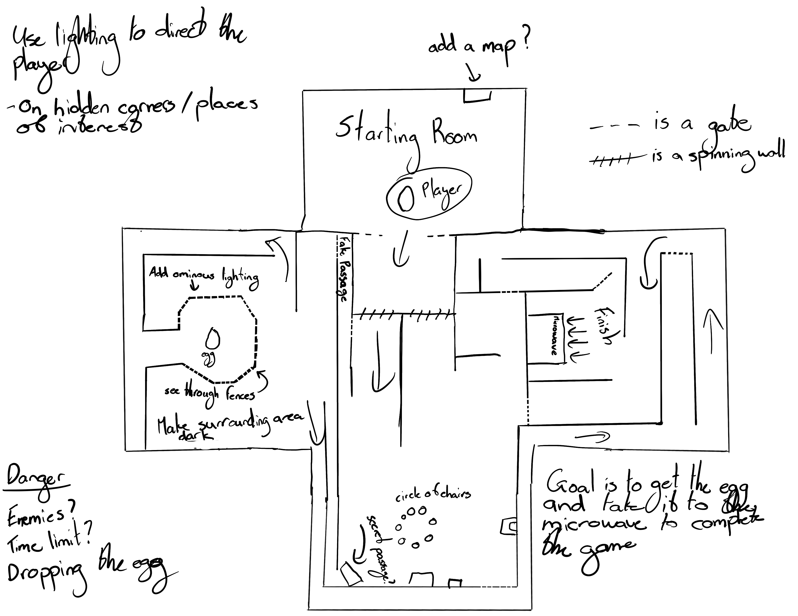
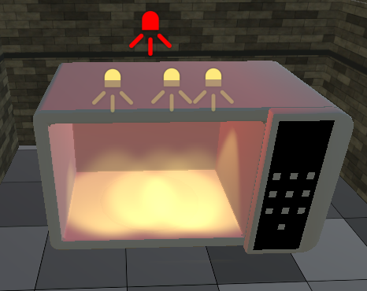

# Development Journal - Eggscape
Fundamentals of Game Development (FGCT4015)

Bradley Curtis

2309516

Anna Rogers

2315276

## Research

### Concept

- Within the group game as a whole, we ended up going through many different game ideas before we landed on on one that stuck. Initially we planned on making a dropper game similar to the minecraft droppers, then we moved onto the idea of a vertical playformer game but ultimately we ended up deciding on a slower paced, dark puzzle escape game. (Minecraft Maps, 2022)   (Wikipedia, 2024)

- With the egg theme we were given we thought it might be interesting to make the player have to find and cook the egg. This concept was built upon throughout the development of the game.

# The Process
### Gameplay

- Starting off with basic player movement, we had just copied over a script from one of our previous projects and changed some of the values to make it feel more fluid within the smaller map design.

```csharp
private void Awake()
    {
        _rb = GetComponent<Rigidbody>();
        _mainCamera = Camera.main;
    }

    private void Update()
    {
        if (Input.GetKeyDown(KeyCode.Space) && _isGrounded)
        {
            _rb.velocity = new Vector3(_rb.velocity.x, 0, _rb.velocity.z);
            _rb.AddForce(Vector3.up * jumpForce, ForceMode.Impulse);
            _isGrounded = false;
        }

        if (Input.GetKeyDown(KeyCode.R))
        {
            Restart();
        }
        if (Input.GetKeyDown(KeyCode.Escape))
        {
            ExitToMenu();
        }
    }

    private void FixedUpdate()
    {
        Vector3 cameraForward = Vector3.Scale(_mainCamera.transform.forward, new Vector3(1, 0, 1)).normalized;
        Vector3 movement = (cameraForward * Input.GetAxis("Vertical") + _mainCamera.transform.right * Input.GetAxis("Horizontal")).normalized;

        _rb.AddForce(movement * playerSpeed * (_isGrounded ? 1 : airControlFactor), ForceMode.Force);

        if (_rb.velocity.magnitude > maxVelocity)
        {
            _rb.velocity = _rb.velocity.normalized * maxVelocity;
        }

        _isGrounded = Physics.Raycast(transform.position + Vector3.up * 0.5f, Vector3.down, 2f, ~0);
        _rb.drag = _isGrounded ? groundDrag : 0f;
    }
```

- Following that, the map design came next. A big part of the game comes from its hidden paths and secret corners so we took time to plan out and draw the map in order to create a cohesive and challenging experience for the player.



- With the mapped out level above, we imported some world building assets and got started making the level. (@UnityAssetStore, 2019)


- The next major part of gameplay was going to be the ability to pick up and manipulare the eggs location within the level. Throughout making this work we encountered many bugs such as the object clipping through walls, the egg flying away when you moved and violently shaking in place wehn you were standing still. Eventually after lots of trial and error we ended up with the following script.

```csharp
private void Start()
    {
        mainCamera = Camera.main;
        rb = GetComponent<Rigidbody>();
        player = Camera.main.transform;
    }

    private void OnMouseDown()
    {
        if (mainCamera != null)
        {
            Ray ray = mainCamera.ScreenPointToRay(Input.mousePosition);
            RaycastHit hit;

            if (Physics.Raycast(ray, out hit, Mathf.Infinity, draggableLayer))
            {
                if (hit.collider == GetComponent<Collider>())
                {
                    offset = transform.position - hit.point;
                    isDragging = true;
                    objectDistanceFromCamera = Vector3.Distance(transform.position, player.position);

                    if (rb != null)
                    {
                        rb.useGravity = false;
                        rb.isKinematic = false;
                        rb.constraints = RigidbodyConstraints.FreezeRotation;
                    }
                }
            }
        }
    }

    private void OnMouseDrag()
    {
        if (isDragging && mainCamera != null)
        {
            Vector3 cameraForward = mainCamera.transform.forward;
            Vector3 targetPosition = player.position + cameraForward * objectDistanceFromCamera;
            targetPosition.y = transform.position.y;

            if (rb != null)
            {               
                Vector3 direction = targetPosition - transform.position;
                Vector3 velocity = direction.normalized * dragSpeed * Time.deltaTime;                
                rb.velocity = velocity;
                if (Vector3.Distance(transform.position, targetPosition) < 0.25) rb.velocity = Vector3.zero; 
            }
            else
            {
                transform.position = Vector3.Lerp(transform.position, targetPosition, (dragSpeed * 1000) * Time.deltaTime);
            }
        }
    }

    private void OnMouseUp()
    {
        isDragging = false;

        if (rb != null)
        {
            rb.useGravity = true;
            rb.constraints = RigidbodyConstraints.None;
        }
    }

    private void Update()
    {
        if (Input.GetKey(KeyCode.E))
        {
            MoveObjectVertically(moveVerticalAmount);
        }
        else if (Input.GetKey(KeyCode.Q))
        {
            MoveObjectVertically(-moveVerticalAmount);
        }
    }

    private void MoveObjectVertically(float verticalMovement)
    {
        if (rb != null)
        {
            Vector3 verticalMove = new Vector3(0f, verticalMovement, 0f);
            rb.MovePosition(transform.position + verticalMove);
        }
        else
        {
            transform.position += new Vector3(0f, verticalMovement, 0f);
        }
    }
}
```

- The above code allowed us to continue with the entire game idea as if we werent able to get this working we would need to rething our entire game.

- Most of the code in the above script was made with previous knowedge of physics concepts however a lot of time was spent looking at Unity's Scripting API website for getting the raycast to work as intended (Unity Technologies, 2019)

- Getting the game to complete when the egg touches the microwave was simple and we just used colission detection to do this


```csharp
using UnityEngine;
using UnityEngine.SceneManagement;
public class EggCollisionDetector : MonoBehaviour
{    
    public GameObject objectToDetect;

    private void OnCollisionEnter(Collision collision)
    {

        if (collision.gameObject == objectToDetect)
        {
            SceneManager.LoadScene(3);
            Debug.Log("Collision detected with the specified object: " + objectToDetect.name);

        }
    }
}
```
### Music
- For the music we wanted to create an upbeat horror ambience. We wanted it to be somewhere between horror ambience and the type of music that you can bop your head to as our game isnt a full on horror game and has a fun element to it.

### Scenes 
- For the menu, death screen and win screen we used different scenes and coded them to switch between when certain criteria is met. For the canvas background we used an egg texture that was made by Anna on photoshop using the maya UV unwrap. 

- The code for the buttons to navigate between the scenes was fairly simple as seen below. It was code we had used before so knew how it worked and how to adapt it.

#### RestartScreen.cs
```csharp

using UnityEngine;
using UnityEngine.SceneManagement;
using System.Collections;
    
public class RestartGame : MonoBehaviour {
    
    public void Restart() {
        SceneManager.LoadScene(1);
    }
    
} 

```

#### PlayGame.cs
```csharp
using System.Collections;
using System.Collections.Generic;
using UnityEngine;
using UnityEngine.SceneManagement;

public class PlayGame : MonoBehaviour
{
    public void LoadGame()
    {
        SceneManager.LoadScene(1);
    }
}
```
#### MainMenu.cs
```csharp
using System.Collections;
using System.Collections.Generic;
using UnityEngine;
using UnityEngine.SceneManagement;

public class MainMenu : MonoBehaviour
{
    public void LoadGame()
    {
        SceneManager.LoadScene(0);
    }
}
```
#### QuitGame.cs
```csharp
using System.Collections;
using System.Collections.Generic;
using UnityEngine;

public class QuitGame : MonoBehaviour
{
    public void QuitG(){
        Application.Quit();
    }
}

```


- [Link to the game on Itch.io]()
- [Link to the Github Repository](https://github.com/2309516/Eggscape)
- [Link to gameplay video demonstration](https://youtu.be/sI5QB1C4oDc)

## Reflection

### What would you do differently next time?
- If we could start the group game over again we both agree that more planning and preperation wouldve set us up to have a better product at the end of the 10 weeks.

- Communication throughout the process of developing the game hasnt stable all the way through. Some weeks neither of us touched the game and trying to come back to it after a while ended up eating more time than slowing working on the game consistantly over the assignment period. Therefore if we could go back and work on it all over again we would both do little bits consistantly rather than a lot of work at the end,

## Implementation

### What was the process of completing the task? What influenced your decision making?
- Due to a lack of proper planning, a big factor of whaty influenced decision making came down to the amount of time we had left when we really started focussing on the game. This led to underdeveloped ideas a some areas of poor execution.

### What was the process of completing the task at hand? Did you do any initial planning?
- We did have initial planning such as dividing up tasks and research and then colaborating one day each week. The actual game idea changed over the weeks and most of the initial planned ended up not being used. 
### Did you receive any feedback from users, peers or lecturers? How did you react to it?
- The feedback we recieved was about the lighting in the game. The game was too dark to where you couldn't see were going because. Because of how dark the game was, when you dropped the egg it was virtually impossible to find without starting over.

- We ended up changing elements of the game off of the back of this feedback. The changes we made were adding more lighting and a light to make the egg glow. We did this because if we added more lighting then we already did to the game the world would be too bright, therefore adding the glowing egg meant we didnt need to ruin the darker aspect of the game.

### What creative or technical approaches did you use or try, and how did this contribute to the outcome?
- The main and most obvious creative approach was to make the game horror-esque whilst retaining the lighthearted egg aspect we were given. Making the scene dark and spooky with spread out lighing and an aspect of being rushed with the timer constantly ticking down allowed us to make the game more simple in terms of the technical aspect. As the player is going to be tring to find their way out of the dark maze, they will be less focused on the fact that the only real gameplay aspect is the ability to pick up and move the egg. This gave us a lot of freedom to create the level how we want whilst maintaining the simple gameplay loop.

### Did you have any technical difficulties? If so, what were they and did you manage to overcome them?
- The main technical difficulties we had was time management. We both agree that we put the game off for longer than we should have and this impacted the depth of our ideas.

- At one point we struggled with merge conflicts as well as sometimes working on the wrong iteration of the game which ended up in lost work and wasted time.

## Self Evaluation
### Anna
Due to struggles with code and time management on projects before this one I was late to helping with this game. It took me a while to be able to help with this game, but the work I did do further refined the game as a whole and added finishing touches. I also added my own egg texture which I created with the knowledge I gained from 3D, and used this as the cover art, making simplistic and straightforward interactible screens.

I know I could have done more for this project, and regret not sorting my prior assignments out sooner. If I had done I would have been more of an aid for this project. 

### Bradley
I feel that I could have possibly added more in depth mechanics, maybe enemies and other gameplay aspects to improve the feel of the game however with that said, I am happy with how the game turned out in the end. My scripts for both the player movement and control tool as well as designing the layout of the game gave us both a good starting ground to work with. 

Moving forward, proper planning as well as having a solid gameplay direction is going to be something I work on having before I start any project as I believe this well help me drastically in the long run.

## Bibliography

Minecraft Maps. (2022). Dropper - Minecraft Maps. [online] Available at: https://www.minecraftmaps.com/dropper (Accessed  04/10/2024).

Wikipedia. (2024). Only Up! [online] Available at: https://en.wikipedia.org/wiki/Only_Up. (Accessed  04/10/2024).

‌Unity Technologies (2019). Unity - Scripting API: Physics.Raycast. [online] Unity3d.com. Available at: https://docs.unity3d.com/ScriptReference/Physics.Raycast.html. (Accessed  25/10/2024).

‌Unity Technologies (2020). 3D character picking up item. [online] Unity Discussions. Available at: https://discussions.unity.com/t/3d-character-picking-up-item/793187. (Accessed  25/10/2024).


## Declared assets
Kenney (s.d.) Crosshair Pack · Kenney. At: https://kenney.nl/assets/crosshair-pack (Accessed  25/10/2024).

Kitchen Furniture Starterpack | 3D Furniture | Unity Asset Store (s.d.) At: https://assetstore.unity.com/packages/3d/props/furniture/kitchen-furniture-starterpack-209331 (Accessed  25/10/2024).

Floor materials pack v.1 | 2D Floors | Unity Asset Store (s.d.) At: https://assetstore.unity.com/packages/2d/textures-materials/floors/floor-materials-pack-v-1-140435 (Accessed  25/10/2024).

Free 3D Egg Models | TurboSquid (s.d.) At: https://www.turbosquid.com/Search/3D-Models/free/egg (Accessed  04/12/2024).
恐怖 fear | Royalty-free Music (s.d.) At: https://pixabay.com/music/upbeat-fear-14380/ (Accessed  25/11/2024).

microwave ding | Royalty-free Music (s.d.) At: https://pixabay.com/sound-effects/microwave-ding-104123/ (Accessed  28/11/2024).

怖いもの見たさ I’ve seen scary things | Royalty-free Music (s.d.) At: https://pixabay.com/music/beats-ix27ve-seen-scary-things-151751/ (Accessed  28/11/2024).

‌ ‌The following assets were created or modified with the use of GPT 4o:

- ControlTool.cs
- PlayerController.cs

